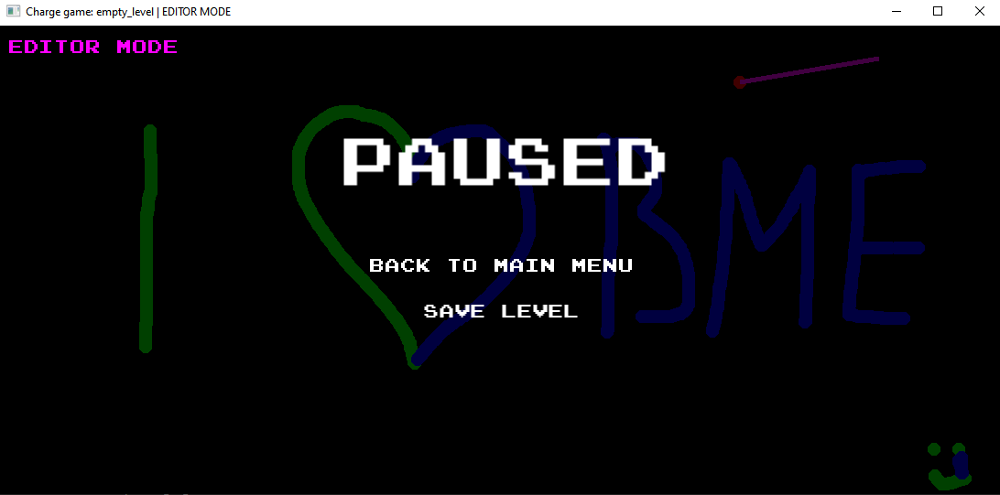

# Charge Game

## Description

This is a repository for the Charge Game project. This project was created as a university finals project at **Budapest University of Technology and Economics**
for the course **Basics of Programming 2 (BMEVIAUAA01)**.

This game lets the player place different charges around the 2D plane and interact with them through the player entity. The physical simulation uses the Euler method, which just means "we assume everything is linear if you look at it from close enough" in fancy terms. Basically the program just calculates the forces between the player and every object very fast and adds them together, thus getting a surprisingly accurate simulation.

You can play around, explore the electric fields of different shapes of charges, be they small or big.

The main idea behind the project was to learn the basics of creating a physics simulation and to learn more about graphical visualizations with the SFML library.
The code is written with object-oriented design patterns in mind, but where I found it unnecessary to use classes I just used basic global functions and global variables.

## Table of Contents

- [Prerequisites](#prerequisites)
- [Build](#build)
- [Usage](#usage)
- [Documentation](#documentation)
- [Keybindings](#keybindings)

## Prerequisites

### SFML

To build the project, first you need to install the great and holy [SFML library](https://www.sfml-dev.org/index.php). For this project I used [SFML 2.6.1](https://www.sfml-dev.org/download/sfml/2.6.1/). You can download SFML through their [official website](https://www.sfml-dev.org/download.php), though I **strongly advise** against it. Either you should install SFML through your beloved package manager (pacman with [mysys](https://packages.msys2.org/package/) if you're on windows and apt if youre on linux) **OR** compile it yourself from their [official source code](https://github.com/SFML/SFML) to prevent compiler version incompatibilities.

Friendly reminder if using mysys and pacman: make sure to download the version for the correct toolchain you want to use (choose the repository at the top left corner on the mysys website).

### nlohmann JSON Library

In this project, I used the nlohmann JSON library to handle JSON data. It provides a simple interface for parsing and generating JSON data.

To use the nlohmann JSON library in your project, you need to include the nlohmann header files and link against the nlohmann library. You can find the library and header files on the [nlohmann GitHub repository](https://github.com/nlohmann/nlohmann-JSON).

You can again either get it via a package manager, *(which I suggest to avoid the pain I had to go through,)* or compile it yourself.

## Build

There is a makefile template in the repository. Use it to make the project with mingw32-make. To have the program to compile specify the path of the SFML precompiled libraries at LDFLAGS.

If you are not using gcc you should update CXX and CXXFLAGS too.

After these steps you should be able to just run mingw-32make (or just make on UNIX systems) and the program should be compiled corectly without warnings. The binary can be found as ./bin/charge.exe.

## Usage

In the main menu you can select from the 6 most recent levels you saved.

You can create levels by clicking editor mode and selecting an empty slot. Then you can draw freely any shape of charge you want by holding the LCtrl key and dragging while holding down the left or right mouse button. The left button will create opposite (attracting), the right identical (repulsive) charges compared to the player. If you hold down the LAlt key while dragging with the mouse, you can delete obstacles you placed.

In editor mode you can also resize the window to your own needs, as the size of the window is also the size of the level.

By pressing and holding the space key you can position the player to your mouse cursor.

You can also play the level you are creating while in editor mode. At the start you will be able to shoot the player by clicking on the player and dragging the mouse away in any direction. If you want to zero the speed of the player, you can press the Z key, if you want to reset the level to the starting sttate you can press the R key and if in editor mode you want to not reset the level but be able to shoot the player again you should press the R key while holding the LCtrl.

By pushing the escape key you can open the pause menu, where if you are in editor mode, you can click the save level button and specify a 20 character long level name consisting of lower-case letters of the english alphabet. If you press enter, the level will be saved and you will return to the pause menu. The next time you open the game you will be able to see the first 6 levels you created. If you create more levels, they will appear as you delete levels from the 6 appearing in the menu and restart the game.

For exact [keybingings](#keybindings) see below.

## Documentation

More extensive [Doxygen documentation](doc/html/index.html) is provided in the doc folder in the repository *(generated by Doxygen 1.9.8)*.

## Keybindings

| Key | Action | Only in editor mode |
| --- | ------ | --------------------|
| Space | Position the player to the mouse cursor | ✓ |
| Left Mouse Button + LCtrl | Create opposite (attracting) charges | ✓ |
| Right Mouse Button + LCtrl | Create identical (repulsive) charges | ✓ |
| Left Mouse Button + LAlt | Delete obstacles | ✓ |
| Z | Zero the speed of the player | ✓ |
| R | Reset the level to the starting state |
| R + LCtrl | Reset the level without clearing charges | ✓ |
| Escape | Open the pause menu |
| Save Level Button (in pause menu) | Save the level with a 20 character long name consisting of lowercase letters of the English alphabet | ✓ |

## Demo picture

